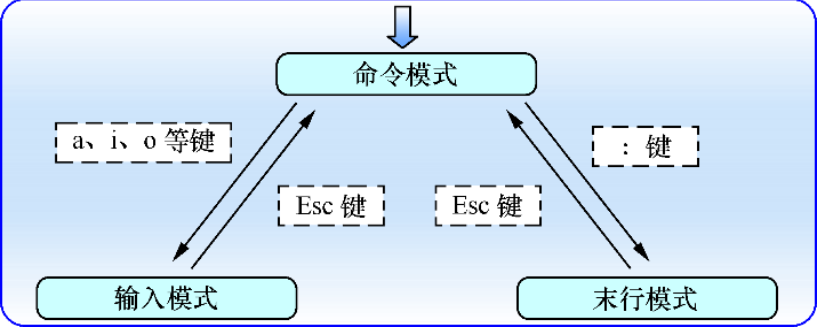

# Vim Guide

---

```shell
$ vimtutor			# 《VIM教程》
```

---

## 基础

### vim的三种模式

- 命令模式：可对文本进行复制、粘贴、删除、查找等操作
- 输入模式：文本录入
- 末行模式：保存或者退出当前文件，以及设置编辑环境和执行命令



### vim的快捷键

#### 退出

| 快捷键 | 功能     | 备注                    |
| ------ | -------- | ----------------------- |
| :w     | 保存     |                         |
| :q     | 退出     |                         |
| :q!    | 强制退出 | 强制保存是:w!，以此类推 |
|        |          |                         |

#### 执行命令

| 快捷键   | 功能       | 备注 |
| -------- | ---------- | ---- |
| :command | 执行该命令 |      |
|          |            |      |

#### 跳转

| 快捷键  | 功能                 | 备注 |
| ------- | -------------------- | ---- |
| :[0～∞] | 跳转到该数字指定的行 |      |
| gg      | 跳转到开头           |      |
| G       | 跳转到结尾           |      |

#### 编辑

| 快捷键 | 功能     | 备注                                     |
| ------ | -------- | ---------------------------------------- |
| yy     | 复制一行 | [0～∞]yy——复制从光标所在行开始指定的行数 |
| dd     | 剪切一行 | [0～∞]dd——剪切从光标所在行开始指定的行数 |
| p      | 粘贴     | 将`yy`或者`dd`复制/剪切的行进行粘贴      |


---

## 进阶

### vim的快捷键

#### 搜索

| 快捷键        | 功能                  | 备注                             |
| ------------- | --------------------- | -------------------------------- |
| :/str         | 由上至下搜索指定`str` | `n`定位到下一个，`N`定位到上一个 |
| /str          | 由上至下搜索指定`str` | 高亮所有匹配结果，不支持循环定位 |
| ?str 和 :?str | 由下至上搜索指定`str` | 不常用                           |

#### 替换

| 快捷键       | 功能                                     | 备注                   |
| ------------ | ---------------------------------------- | ---------------------- |
| :s/one/two   | 将当前光标所在行的所有`one`替换成`two`   | 没有空格               |
| :s/one/two/g | 将当前光标所在行的第一个`one`替换成`two` | 没有空格               |
| :%s/one/two  | 将全文中的所有`one`替换成`two`           | 最后加不加`/g`效果一样 |

#### 文件

| 快捷键       | 功能               | 备注           |
| ------------ | ------------------ | -------------- |
| :so ~/.vimrc | 重新加载.vimrc文件 | 不只是配置文件 |

#### 外部组件

| 快捷键          | 功能                            | 备注             |
| --------------- | ------------------------------- | ---------------- |
| :shell          | 在不退出vim的情况下打开一个终端 | `exit`退出该终端 |
| :fi             | 显示当前文件基本信息            |                  |
| <LocalLeader>fi | 打开文件管理器插件              |                  |


